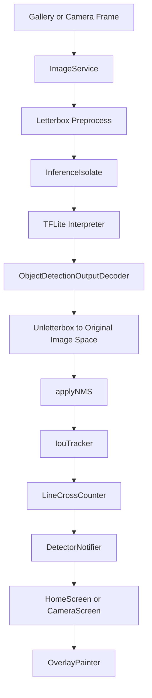

# Real-Time Object Detection & Counting App

Flutter app for on-device object detection and counting with Google AI Edge / MediaPipe EfficientDet exported to TensorFlow Lite. The app supports still-image detection, live camera scanning, object tracking, line-cross counting, overlay rendering, and CSV/JSON export.

## Features

- Still image detection from gallery or camera capture.
- Live camera scanning with `CameraController.startImageStream`.
- YUV420, NV21, BGRA8888, and JPEG camera frame conversion.
- Letterbox preprocessing to preserve aspect ratio before model inference.
- TFLite inference in a Dart isolate with recovery after worker errors/timeouts.
- Google AI Edge / MediaPipe EfficientDet raw output decoding behind a small decoder adapter.
- Optional decoder class filtering and score activation for compatible custom models.
- Class-aware Non-Maximum Suppression.
- IoU tracker with center-distance fallback for low-FPS object jumps.
- Normalized counting line coordinates, draggable line handles, and direction-aware counting.
- Canvas overlay for boxes, track paths, labels, confidence, and counting line.
- CSV and JSON export for detection/count reports.

## Current Model

The default model is declared in `pubspec.yaml`:

```yaml
assets:
  - assets/models/efficientdet_lite0_float16.tflite
```

Runtime config lives in `lib/data/models/model_config.dart`:

- Input size: `320`
- Model path: `assets/models/efficientdet_lite0_float16.tflite`
- Labels: COCO labels from the MediaPipe model metadata, including `???` placeholders for sparse COCO IDs
- Default confidence threshold: `0.25`
- Default IoU threshold: `0.45`

## Architecture



### Main Modules

- `lib/features/detection`: image preprocessing, TFLite isolate, output decoding, NMS.
- `lib/features/tracking`: object track IDs and path history.
- `lib/features/counting`: normalized counting line and line-cross counting.
- `lib/features/overlay`: canvas overlay and draggable counting line handles.
- `lib/features/export`: CSV/JSON export.
- `lib/features/model_management`: model metadata repository.
- `lib/presentation/state`: Riverpod app state and workflow orchestration.

## Live Camera Flow

Live mode uses `startImageStream`, throttled to one inference request at a time. The current interval is controlled by `_minInferenceInterval` in `CameraScreen`.

The stream frame is converted to JPEG bytes by `ImageService.convertCameraImage`, then reuses the same still-image preprocessing and inference path. This keeps one model pipeline for both still images and live camera frames.

Physical-device testing is still required for camera orientation and mirror behavior because Android/iOS sensor orientation can vary by device.

## Counting Behavior

Counting lines are stored as normalized coordinates:

- `(0, 0.5)` means left edge at vertical center.
- `(1, 0.5)` means right edge at vertical center.

The line is mapped to image pixels before counting and to view pixels before painting. Direction modes are:

- `CountingDirection.any`
- `CountingDirection.positive`
- `CountingDirection.negative`

## Training and Export

Recommended workflow: train and export a compatible object detector with Google AI Edge / MediaPipe Model Maker, then place the `.tflite` file under `assets/models/` and update `ModelConfig.modelAssetPath` plus `pubspec.yaml`.

The default bundled model is the Google AI Edge / MediaPipe EfficientDet-Lite0 float16 Object Detector model. Its direct TFLite outputs are raw box offsets `[1, 19206, 4]` and class scores `[1, 19206, 90]`; the app performs EfficientDet anchor decoding and NMS in Dart.

The bundled model uses probability-like scores, so the decoder default is `ScoreActivation.none`. Custom models that output logits should explicitly switch the decoder to `sigmoid` or `softmax` and add matching tests.

See:

- `docs/model_maker.md`
- `docs/runtime_verification.md`

## Development

Install dependencies:

```bash
flutter pub get
```

Run static analysis:

```bash
flutter analyze
```

Run tests:

```bash
flutter test --reporter compact
```

Sync CodeGraph after code changes:

```bash
codegraph.cmd sync .
```

Run on a connected device:

```bash
flutter run
```

Run release mode:

```bash
flutter run --release
```

## Test Coverage

Current unit tests cover:

- Google AI Edge / MediaPipe EfficientDet anchor generation and raw detection decoding.
- The active output decoder adapter.
- Boundary clamping, degenerate-box filtering, optional class masks, score activation, and shape-mismatch debug logging.
- Non-Maximum Suppression.
- Image YUV to RGB channel conversion helpers.
- TFLite service isolate recovery.
- IoU tracker matching, low-IoU center-distance fallback, and lost-track cleanup.
- Line-cross counting, duplicate-count prevention, and direction filtering.
- Initial app widget load.

## Production Checklist

- Verify camera orientation and mirror behavior on physical Android and iOS devices.
- Profile inference latency, preprocessing latency, memory, and thermal behavior.
- Confirm the active model output tensor layout before release if replacing the default EfficientDet-Lite0 model.
- Confirm the active labels are aligned with the model metadata, including sparse COCO placeholder entries.
- Re-run line-cross counting checks after detector changes because bounding box footprints can shift between model families.
- Tune live inference throttle for the target device class.
- Calibrate counting-line direction for each real installation.
- Add share/open-file UX for exported CSV/JSON reports if operators need direct handoff.
