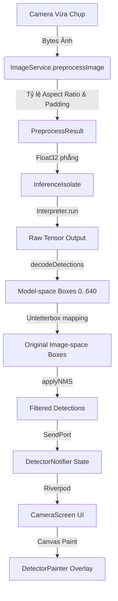
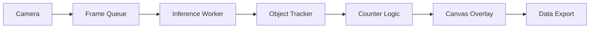

# Real-Time Object Detection & Counting App (YOLOv8 + LiteRT)

Ứng dụng đếm số lượng vật thể thời gian thực sử dụng mô hình YOLOv8 được tối ưu hóa qua TensorFlow Lite (LiteRT) trên nền tảng Flutter. Dự án hỗ trợ khả năng phân tích luồng camera snapshot, xử lý tác vụ nặng qua luồng Isolate riêng biệt nhằm đảm bảo UI mượt mà 60 FPS, và tự động căn chỉnh tọa độ hộp giới hạn (Bounding Box) chính xác theo kích thước ảnh gốc.

---

## 1. Project Overview

Ứng dụng này giải quyết bài toán nhận diện và đếm số lượng vật thể tự động (ví dụ: đếm hàng hóa, đếm sản phẩm trên băng chuyền, hoặc đếm thiết bị).

### Key Features

- **Real-Time Camera Scanning**: Chụp ảnh luồng định kỳ (1 FPS) từ camera để phân tích nhận diện mà không gây nóng máy hoặc giật lag luồng giao diện chính.
- **Letterbox Preprocessing**: Tự động thay đổi kích thước ảnh giữ nguyên tỷ lệ aspect ratio và bù đệm xám (padding 114) chuẩn hóa ảnh đầu vào mô hình YOLOv8.
- **Isolate-Based Inference**: Chạy tiến trình suy luận TensorFlow Lite trong nền thông qua Dart Isolate độc lập kết hợp `BackgroundIsolateBinaryMessenger`.
- **Value-Object Bounding Boxes**: Giải mã kết quả Tensor và lọc trùng lắp bằng thuật toán Non-Maximum Suppression (NMS) với độ chính xác cao.
- **Canvas-Level Overlay**: Tự động chuyển đổi tọa độ hộp từ không gian model về kích thước thực tế hiển thị trên màn hình sử dụng cơ chế `applyBoxFit(BoxFit.contain)`.

---

## 2. System Architecture

Hệ thống được chia thành 3 lớp chính: **Presentation Layer**, **Domain Layer** (Use Cases), và **Data Layer** (Services/Models).

### Luồng xử lý dữ liệu hiện tại (Data Pipeline)



### Kiến trúc module hướng tương lai (Future Pipeline Blueprint)

Để đáp ứng các bài toán sản xuất phức tạp hơn (ví dụ: bám đuôi đối tượng vật lý, tránh đếm trùng khi đối tượng di chuyển), hệ thống được thiết kế hướng tới luồng xử lý dạng hàng đợi:



---

## 3. Abstract Blueprints for Expansion

Để khắc phục việc phụ thuộc cứng vào thư viện TensorFlow Lite và hỗ trợ cơ chế quản lý đa mô hình động (Dynamic Model Swap), dưới đây là sơ đồ thiết kế trừu tượng được đề xuất:

### A. Detector Abstraction

Tách biệt phần suy luận (Inference Engine) thông qua interface `Detector` chung:

```dart
abstract class Detector {
  bool get isReady;
  Future<void> init();
  Future<List<Detection>> detect(Uint8List imageBytes, {
    double confidenceThreshold,
    double iouThreshold,
  });
  void dispose();
}

// Các triển khai cụ thể:
class TfliteDetector implements Detector { ... }
class OnnxDetector implements Detector { ... }
class NcnnDetector implements Detector { ... }
```

### B. Model Manager & Loader

Quản lý siêu dữ liệu mô hình và nạp tự động từ tệp tin hoặc máy chủ từ xa:

```dart
class ModelInfo {
  final String id;
  final String name;
  final String modelPath;
  final int inputSize;
  final List<String> labels;

  const ModelInfo({
    required this.id,
    required this.name,
    required this.modelPath,
    required this.inputSize,
    required this.labels,
  });
}

class ModelRepository {
  Future<List<ModelInfo>> getAvailableModels();
}

class ModelLoader {
  Future<Detector> load(ModelInfo info);
}
```

---

## 4. Model Training & Export Guide

Hệ thống mặc định sử dụng mô hình YOLOv8n (YOLOv8 Nano) do Ultralytics cung cấp.

### A. Huấn luyện mô hình (Model Training)

Huấn luyện mô hình nhận diện vật thể tùy chỉnh thông qua thư viện `ultralytics` bằng Python:

```python
from ultralytics import YOLO

# Nạp mô hình pre-trained
model = YOLO('yolov8n.pt')

# Huấn luyện mô hình với tập dữ liệu custom
results = model.train(
    data='custom_dataset.yaml',
    epochs=100,
    imgsz=640,
    device=0 # Dùng GPU CUDA
)
```

### B. Xuất mô hình sang TensorFlow Lite (Model Export)

Mô hình sau khi huấn luyện cần được xuất sang định dạng `.tflite` với kiểu dữ liệu `float32`:

```bash
# Sử dụng CLI của Ultralytics
yolo export model=runs/detect/train/weights/best.pt format=tflite imgsz=640 half=false
```

**Output Tensor Format:**

- Input: `[1, 640, 640, 3]` (RGB normalized to `[0.0, 1.0]`).
- Output: `[1, 4 + num_classes, 8400]` (4 tọa độ đầu là `x_center, y_center, width, height` và các dòng tiếp theo chứa điểm tin cậy của các nhãn lớp).

---

## 5. Testing & Verification

Dự án triển khai mô hình kiểm thử tự động (Unit Tests) nghiêm ngặt tại thư mục `test/` nhằm tránh lỗi logic hồi quy (regression bugs).

### Cấu trúc kiểm thử (Test Cases)

- **`decode_yolo_output_test.dart`**: Kiểm tra tính chính xác của thuật toán giải mã đầu ra Tensor phẳng Float32List sang cấu trúc tọa độ Rect, kiểm thử tính an toàn khi chiều dài dữ liệu lỗi hoặc chứa số không xác định (`NaN/Infinity`).
- **`nms_filter_test.dart`**: Kiểm thử bộ lọc trùng lắp Non-Maximum Suppression (NMS). Xác nhận việc lọc bỏ các hộp đè chéo nhau trên cùng một lớp đối tượng, đồng thời đảm bảo không triệt tiêu các hộp đè chéo nhau thuộc hai nhãn lớp khác biệt.
- **`widget_test.dart`**: Kiểm thử tải và dựng giao diện khởi đầu của ứng dụng (`HomeScreen`).

### Chạy kiểm thử tự động:

```bash
# Chạy phân tích cú pháp tĩnh
flutter analyze

# Chạy toàn bộ test suite
flutter test
```

---

## 6. Benchmarking & Profiling Specification

Trước khi đưa ứng dụng lên hệ thống Production, nhà phát triển cần thực hiện đo đạc hiệu năng trực tiếp trên thiết bị vật lý thông qua công cụ DevTools của Flutter.

### Các thông số cần đo lường (Metrics)

1. **Inference Latency (Độ trễ suy luận)**: Thời gian chạy lệnh `interpreter.run(...)` trong Isolate nền (mục tiêu: `< 150ms` trên chip di động tầm trung).
2. **Post-processing Latency**: Thời gian chạy giải mã tọa độ và thuật toán NMS (mục tiêu: `< 10ms`).
3. **RAM Usage (Bộ nhớ RAM tiêu thụ)**: Dung lượng bộ nhớ được cấp phát khi nạp Interpreter và chạy luồng suy luận liên tục (mục tiêu: tăng thêm không quá `80 MB`).
4. **CPU Core Overhead**: Mức tải của các nhân CPU nền khi isolate hoạt động (mục tiêu: threads = 4 để tối ưu hóa đa nhân).
5. **Frame Rate (FPS)**: Tần suất làm tươi màn hình chính của UI Thread (mục tiêu: khóa cứng ổn định ở mức `60 FPS`).

---

## 7. How to Run

### Yêu cầu cấu hình

- Flutter SDK `>= 3.19.0`
- Android: SDK 21 trở lên (Lollipop), yêu cầu camera vật lý và quyền truy cập.
- iOS: iOS 12.0 trở lên, cấu hình khóa quyền camera trong tệp `Info.plist`.

### Các bước khởi chạy

1. **Tải các gói phụ thuộc (Dependencies)**:
   ```bash
   flutter pub get
   ```
2. **Chuẩn bị mô hình**: Đảm bảo mô hình `yolov8n_float32.tflite` (hoặc tệp custom) đã được đặt tại đường dẫn `assets/models/yolov8n_float32.tflite` và cấu hình khai báo tài nguyên đầy đủ trong `pubspec.yaml`.
3. **Chạy ứng dụng**:

   ```bash
   # Chạy debug trên thiết bị đang kết nối
   flutter run

   # Build ứng dụng ở chế độ tối ưu hóa hiệu năng cao (Release)
   flutter run --release
   ```
