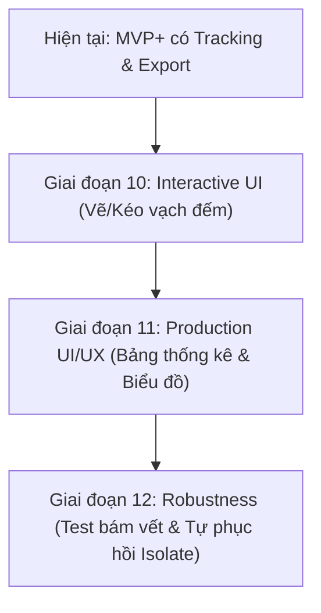

# Đánh giá Logic & UI/UX Hệ Thống (MVP vs. Production)

Bản đánh giá chi tiết này phân tích cấu trúc logic hiện tại của dự án **diemsoluong** (Đếm Số Lượng Vật Thể), trải nghiệm người dùng (UI/UX) và các khoảng cách cần vượt qua để đưa ứng dụng từ trạng thái **MVP nâng cao** lên **Production-Ready** (sẵn sàng thương mại hoá).

---

## 1. Đánh giá Logic Hệ Thống

### Điểm Tốt (Đã Đạt Production-Grade)
* **Kiến trúc luồng xử lý Isolate phụ:** Interpreter TFLite sống vĩnh viễn trên một `BackgroundIsolate` riêng biệt. Việc tiền xử lý ảnh (`ImageService`), suy luận (`Interpreter.run`), giải mã (`decodeDetections`) và lọc chồng lấn (`applyNMS`) đều chạy trên luồng phụ này. UI Thread hoàn toàn không bị nghẽn (0% giật lag/jank khi quét).
* **Decoupled Contracts (Loại bỏ phụ thuộc cứng):** Đã phân rã toàn bộ logic nghiệp vụ dưới các Interfaces trừu tượng (`Detector`, `Tracker`, `Counter`, `Exporter`, `ModelRepository`). Dễ dàng thay thế mô hình TFLite bằng ONNX/NCNN hoặc thuật toán bám vết khác mà không cần sửa giao diện.
* **Thuật toán toán học chuẩn xác:** 
  * `IouTracker` quản lý định danh ID, lọc mất dấu khung hình (`maxLostFrames`) và giới hạn độ dài vết di chuyển (`maxPathLength`) tránh rò rỉ bộ nhớ.
  * `LineCrossCounter` sử dụng thuật toán nhân chéo vector hướng để xác định giao điểm đoạn di chuyển với vạch đếm rất tối ưu và chính xác.

### Khoảng cách cần hoàn thiện lên Production
* **Thiếu cơ chế tự phục hồi (Isolate Recovery):** Nếu thiết bị chạy các mô hình quá nặng hoặc gặp lỗi OutOfMemory (OOM) làm isolate bị sập, hệ thống hiện tại chưa tự khởi động lại isolate.
* **Chưa phủ đầy đủ Unit Test cho Tracking & Counting:** Chúng ta mới chỉ viết test cho phần `nms_filter` và `decode_detections`. Cần bổ sung test suite giả lập tọa độ di chuyển của `Track` cắt qua vạch để kiểm thử `LineCrossCounter`.

---

## 2. Đánh giá Giao Diện & Trải Nghiệm (UI/UX)

### Hiện trạng
Hiện tại, giao diện của ứng dụng đang ở mức **MVP+**:
* Có giao diện xem camera live mượt mờ.
* Vẽ đúng khung hình hộp giới hạn, nhãn định danh ID và đường di chuyển (trajectory path) với màu sắc phân biệt trực quan.
* Đã có nút xuất dữ liệu nhanh CSV/JSON ngay trên màn hình.

### Các điểm yếu UI/UX cần cải tiến để đạt mức Premium
1. **Vạch đếm bị cố định (Static Line):** 
   * *Vấn đề:* Vạch đếm hiện đang được hardcode tại toạ độ cố định cắt ngang màn hình.
   * *Yêu cầu Production:* Người dùng phải có thể tương tác kéo thả đầu mút vạch đếm (Drag-and-drop / Gesture Detector) trực tiếp trên màn hình camera/ảnh chụp để thay đổi góc đếm tùy ý.
2. **Thiếu bảng thống kê chi tiết (Detailed Statistics Dashboard):**
   * *Vấn đề:* Mới chỉ hiển thị một dòng text tổng số vật thể đếm được.
   * *Yêu cầu Production:* Cần một Bottom Sheet vuốt lên hoặc panel thống kê hiển thị chi tiết số lượng của từng class (ví dụ: Xe máy: 15, Ô tô: 4, Người đi bộ: 2) kèm icon trực quan, thay vì gộp chung một con số.
3. **Mỹ thuật giao diện (Aesthetics):**
   * Giao diện hiện tại khá cơ bản. Nên nâng cấp lên phong cách Dark Mode hiện đại, sử dụng hiệu ứng viền mờ (glassmorphism), phông chữ đồng bộ (ví dụ: Inter/Outfit) và các nút nhấn có hiệu ứng micro-animations chuyển đổi mượt mà.

---

## 3. Lộ Trình Nâng Cấp Chi Tiết (Roadmap to Production)

Để đưa ứng dụng đạt tiêu chuẩn Production cao cấp, chúng ta đề xuất triển khai thêm các giai đoạn sau:

### Giai đoạn 10: Interactive UI (Vẽ/Kéo vạch đếm)
* Tích hợp `GestureDetector` vào widget render để nhận diện thao tác kéo hai đầu điểm A và B của vạch đếm.
* Cập nhật tức thời toạ độ vạch đếm vào Riverpod state để bộ đếm `LineCrossCounter` cập nhật vùng tính toán.

### Giai đoạn 11: Production UI/UX (Bảng thống kê & Biểu đồ)
* Thiết kế slide-up panel hiển thị danh sách đếm phân loại vật thể.
* Bổ sung biểu đồ cột/tròn nhỏ mô phỏng phân phối số lượng quét được bằng gói vẽ hình nhẹ.

### Giai đoạn 12: Robustness & Recovery
* Viết unit test tự động giả lập bám vết qua vạch.
* Bổ sung try-catch bọc Isolate và tự reset lại luồng phụ khi phát hiện lỗi không mong muốn.
